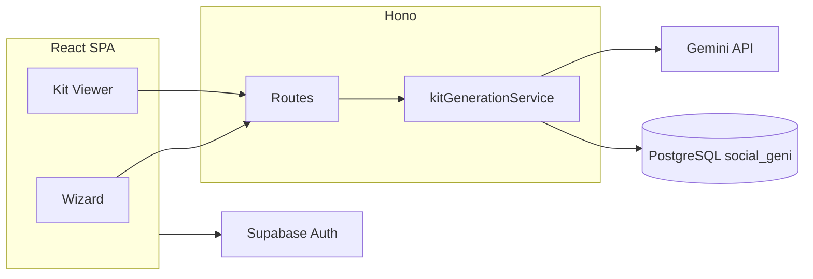

# Architecture (locked stack)

Single-page summary. Deep narrative: [PROJECT_BRIEF.md](PROJECT_BRIEF.md) §10. **Package:** npm workspaces `client` + `server`.

| Layer | Technology | Role |
|-------|------------|------|
| **Frontend** | Vite, React, TypeScript, Tailwind CSS, react-router-dom | Wizard, dashboard, kit viewer, admin UI |
| **Backend** | Hono (Node), TypeScript | REST/BFF: kits, auth bridge, features, admin, analytics |
| **Database** | PostgreSQL | Drizzle ORM; isolated schema **`social_geni`** |
| **Auth** | Supabase (JWT to API) | Sessions; device id header for scoped resources |
| **AI** | Google Gemini (REST) | Server-only; JSON mode + `responseSchema` for main kit |

## Rules

- **Stack changes** (e.g. new primary DB, new AI provider as default) require an **ADR** in [docs/adr/](docs/adr/) before merge.
- **Source of truth:** Drizzle tables in [server/src/db/schema.ts](server/src/db/schema.ts); kit JSON contract in [server/src/logic/responseSchema.ts](server/src/logic/responseSchema.ts).

## Related docs

- [docs/DATABASE.md](docs/DATABASE.md) — table/column inventory for agents.
- [docs/GEMINI_PROMPTS.md](docs/GEMINI_PROMPTS.md) — prompt pipeline map and excerpts.
- [docs/CONTEXT_INDEX.md](docs/CONTEXT_INDEX.md) — full documentation map.
